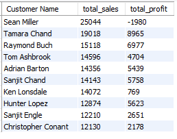

# SQL Analysis Report

This report presents SQL-driven insights on E-commerce sales and customer behavior. Each section includes the SQL query used, the resulting output (shown as an image), and a concise business insight.

---

## 1. Cities with the Highest Sales Share

**SQL Query:**
```sql
SELECT City, SUM(Sales) AS TotalSales
FROM ecommerce_data
GROUP BY City
ORDER BY TotalSales DESC
LIMIT 10;
````


---

## 2. Number of Rows in the Dataset

**SQL Query:**

```sql
SELECT COUNT(*) FROM ecommerce_data;
```


**Insight:**    

---

## 3. Null Values in Each Column

**SQL Query:**

```sql
SELECT 
  SUM(CASE WHEN column1 IS NULL THEN 1 ELSE 0 END) AS column1_nulls,
  SUM(CASE WHEN column2 IS NULL THEN 1 ELSE 0 END) AS column2_nulls,
  ...
FROM ecommerce_data;
```


**Insight:**

---

## 4. Number of Unique Values in Each Column

**SQL Query:**

```sql
SELECT 
  COUNT(DISTINCT column1) AS column1_uniques,
  COUNT(DISTINCT column2) AS column2_uniques,
  ...
FROM ecommerce_data;
```


**Insight:**

---

## 5. Original Dataset Preview

**SQL Query:**

```sql
SELECT * FROM ecommerce_data LIMIT 5;
```


**Insight:**

---

## 6. States with the Highest Sales Share

**SQL Query:**

```sql
SELECT State, SUM(Sales) AS TotalSales
FROM ecommerce_data
GROUP BY State
ORDER BY TotalSales DESC
LIMIT 10;
```


**Insight:**

---

## 7. Top 10 Frequent Customers (Most Orders)

**SQL Query:**

```sql
SELECT Customer_Name, COUNT(*) AS OrderCount
FROM ecommerce_data
GROUP BY Customer_Name
ORDER BY OrderCount DESC
LIMIT 10;
```


**Insight:**

---

## 8. Top 10 Highest Buying Customers (by Sales Amount)

**SQL Query:**

```sql
SELECT Customer_Name, SUM(Sales) AS TotalSales
FROM ecommerce_data
GROUP BY Customer_Name
ORDER BY TotalSales DESC
LIMIT 10;
```



**Insight:**

---

## 9. Top 10 Most Sold Products (by Frequency)

**SQL Query:**

```sql
SELECT Product_Name, COUNT(*) AS TimesSold
FROM ecommerce_data
GROUP BY Product_Name
ORDER BY TimesSold DESC
LIMIT 10;
```

.png)

**Insight:**

---

## 10. Top Selling Category

**SQL Query:**

```sql
SELECT Category, SUM(Sales) AS TotalSales
FROM ecommerce_data
GROUP BY Category
ORDER BY TotalSales DESC;
```


**Insight:**

---

## 11. Total and Average Revenue and Profit

**SQL Query:**

```sql
SELECT 
  SUM(Sales) AS TotalSales,
  AVG(Sales) AS AverageSales,
  SUM(Profit) AS TotalProfit,
  AVG(Profit) AS AverageProfit
FROM ecommerce_data;
```


**Insight:**

---

## 12. Total Sales and Profit by Ship Mode

**SQL Query:**

```sql
SELECT Ship_Mode, SUM(Sales) AS TotalSales, SUM(Profit) AS TotalProfit
FROM ecommerce_data
GROUP BY Ship_Mode;
```


**Insight:**
